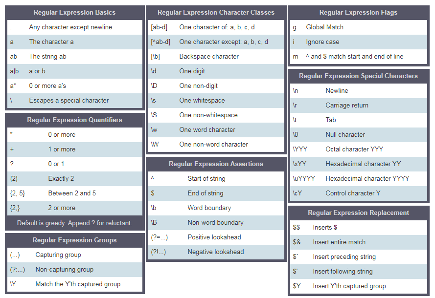

# Package

[](https://nodejs.org/en/learn/getting-started/nodejs-with-typescript)

[](https://www.sohamkamani.com/nodejs/executing-shell-commands/)

[](https://nodejs.org/en/learn/command-line/run-nodejs-scripts-from-the-command-line#run-nodejs-scripts-from-the-command-line)

[](https://www.npmjs.com/package/prompts)

[](https://stackoverflow.com/questions/31596267/how-do-you-access-flags-passed-in-through-the-command-line-in-node)

[](https://nodejs.org/en/learn/getting-started/nodejs-with-typescript)

# REGEX

[tool](https://regex101.com/)

### Special Characters (Meta-characters)

| Meta-character | Meaning                                                              |
| -------------- | -------------------------------------------------------------------- |
| `.`            | Matches any single character except newline                          |
| `^`            | Matches the beginning of a line or string                            |
| `$`            | Matches the end of a line or string                                  |
| `*`            | Matches 0 or more of the preceding element                           |
| `+`            | Matches 1 or more of the preceding element                           |
| `?`            | Matches 0 or 1 of the preceding element (makes it optional)          |
| `\`            | Escapes a special character (e.g., `\.` matches a literal dot `.`)   |
| `[]`           | Character set. Matches any one of the characters inside the brackets |
| `()`           | Groups expressions together and captures matched text                |
| `{}`           | Matches a specific number or range of repetitions (e.g., `{2,4}`)    |

### Character Classes

Character classes match one character out of a set of characters.

| Character Class | Meaning                                                   |
| --------------- | --------------------------------------------------------- |
| `[abc]`         | Matches any single character a, b, or c                   |
| `[^abc]`        | Matches any character except a, b, or c (negation)        |
| `[0-9]`         | Matches any digit                                         |
| `[a-z]`         | Matches any lowercase letter                              |
| `\d`            | Matches any digit (equivalent to `[0-9]`)                 |
| `\D`            | Matches any non-digit (equivalent to `[^0-9]`)            |
| `\w`            | Matches any word character (alphanumeric + underscore)    |
| `\W`            | Matches any non-word character                            |
| `\s`            | Matches any whitespace character (spaces, tabs, newlines) |
| `\S`            | Matches any non-whitespace character                      |

## Operators

### Truthy values

-   All numbers(positive and negative) are truthy except zero
-   All strings are truthy except an empty string ('')
-   The boolean true

### Falsy values

-   0
-   0n
-   null
-   undefined
-   NaN
-   the boolean false
-   '', "", ``, empty string

### [Operator Precedence](https://developer.mozilla.org/en-US/docs/Web/JavaScript/Reference/Operators/Operator_Precedence)

## Date

> date formmater

```ts
const format = (date: Date, options: [any]) => {
    const leftPad = (data: any, spacing: number) => {
        const strPad = String(data);
        if (strPad.length < spacing) {
            return `${'0'.repeat(spacing - strPad.length)}${strPad}`;
        }
        return strPad;
    };
    let dateStr = '';
    for (let i = 0; i < options.length; i++) {
        switch (options[i]) {
            case 'year':
                dateStr.concat(`${leftPad(date.getFullYear(), 4)}/`);
                break;
            case 'month':
                dateStr.concat(`${leftPad(date.getMonth(), 2)}/`);
                break;
            case 'date':
                dateStr.concat(`${leftPad(date.getDate(), 2)}/`);
                break;
            case 'day':
                dateStr.concat(`${leftPad(date.getDay(), 2)}/`);
                break;
            case 'hour':
                dateStr.concat(`${leftPad(date.getHours(), 2)}/`);
                break;
            case 'min':
                dateStr.concat(`${leftPad(date.getMinutes(), 2)}/`);
                break;
            case 'sec':
                dateStr.concat(`${leftPad(date.getSeconds(), 2)}/`);
                break;
            default:
                break;
        }
    }
};
```

# RegEx

## Regular Expressions

A regular expression or RegExp is a small programming language that helps to find pattern in data. A RegExp can be used to check if some pattern exists in a different data types. To use RegExp in JavaScript either we use RegExp constructor or we can declare a RegExp pattern using two forward slashes followed by a flag. We can create a pattern in two ways.

To declare a string we use a single quote, double quote a backtick to declare a regular expression we use two forward slashes and an optional flag. The flag could be g, i, m, s, u or y.

### RegExp parameters

A regular expression takes two parameters. One required search pattern and an optional flag.

#### Pattern

A pattern could be a text or any form of pattern which some sort of similarity. For instance the word spam in an email could be a pattern we are interested to look for in an email or a phone number format number might be our interest to look for.

#### Flags

Flags are optional parameters in a regular expression which determine the type of searching. Let us see some of the flags:

-   g: a global flag which means looking for a pattern in whole text
-   i: case insensitive flag(it searches for both lowercase and uppercase)
-   m: multiline

### Creating a pattern with RegExp Constructor

Declaring regular expression without global flag and case insensitive flag.

```js
// without flag
let pattern = 'love';
let regEx = new RegExp(pattern);
```

Declaring regular expression with global flag and case insensitive flag.

```js
let pattern = 'love';
let flag = 'gi';
let regEx = new RegExp(pattern, flag);
```

Declaring a regex pattern using RegExp object. Writing the pattern and the flag inside the RegExp constructor

```js
let regEx = new RegExp('love', 'gi');
```

### Creating a pattern without RegExp Constructor

Declaring regular expression with global flag and case insensitive flag.

```js
let regEx = /love/gi;
```

The above regular expression is the same as the one which we created with RegExp constructor

```js
let regEx = new RegExp('love', 'gi');
```

## Regex Methods

1. test(stringYouWantToTest):boolean
2. match(string[]):[pattern, index, input and group]
3. search(string): index|-1
4. replace(regex:Regex, strToReplace:string):string

-   []: A set of characters
    -   [a-c] means, a or b or c
    -   [a-z] means, any letter a to z
    -   [A-Z] means, any character A to Z
    -   [0-3] means, 0 or 1 or 2 or 3
    -   [0-9] means any number 0 to 9
    -   [A-Za-z0-9] any character which is a to z, A to Z, 0 to 9
-   \\: uses to escape special characters
    -   \d mean: match where the string contains digits (numbers from 0-9)
    -   \D mean: match where the string does not contain digits
-   . : any character except new line character(\n)
-   ^: starts with
    -   r'^substring' eg r'^love', a sentence which starts with a word love
    -   r'[^abc] mean not a, not b, not c.
-   $: ends with
    -   r'substring$' eg r'love$', sentence ends with a word love
-   \*: zero or more times
    -   r'[a]\*' means a optional or it can occur many times.
-   +: one or more times
    -   r'[a]+' means at least once or more times
-   ?: zero or one times
    -   r'[a]?' means zero times or once
-   \b: word bounder, matches with the beginning or ending of a word
-   {3}: Exactly 3 characters
-   {3,}: At least 3 characters
-   {3,8}: 3 to 8 characters
-   |: Either or
    -   r'apple|banana' mean either of an apple or a banana
-   (): Capture and group



### Square Bracket

Let's use square bracket to include lower and upper case

```js
const pattern = '[Aa]pple'; // this square bracket means either A or a
const txt =
    'Apple and banana are fruits. An old cliche says an apple a day keeps the  doctor way has been replaced by a banana a day keeps the doctor far far away. ';
const matches = txt.match(pattern);

console.log(matches);
```

```sh
["Apple", index: 0, input: "Apple and banana are fruits. An old cliche says an apple a day keeps the  doctor way has been replaced by a banana a day keeps the doctor far far away.", groups: undefined]

```

```js
const pattern = /[Aa]pple/g; // this square bracket means either A or a
const txt =
    'Apple and banana are fruits. An old cliche says an apple a day a doctor way has been replaced by a banana a day keeps the doctor far far away. ';
const matches = txt.match(pattern);

console.log(matches);
```

```sh
["Apple", "apple"]
```

If we want to look for the banana, we write the pattern as follows:

```js
const pattern = /[Aa]pple|[Bb]anana/g; // this square bracket mean either A or a
const txt =
    'Apple and banana are fruits. An old cliche says an apple a day a doctor way has been replaced by a banana a day keeps the doctor far far away. Banana is easy to eat too.';
const matches = txt.match(pattern);

console.log(matches);
```

```sh
["Apple", "banana", "apple", "banana", "Banana"]
```

Using the square bracket and or operator , we manage to extract Apple, apple, Banana and banana.

### Escape character(\\) in RegExp

```js
const pattern = /\d/g; // d is a special character which means digits
const txt = 'This regular expression example was made in January 12,  2020.';
const matches = txt.match(pattern);

console.log(matches); // ["1", "2", "2", "0", "2", "0"], this is not what we want
```

```js
const pattern = /\d+/g; // d is a special character which means digits
const txt = 'This regular expression example was made in January 12,  2020.';
const matches = txt.match(pattern);

console.log(matches); // ["12", "2020"], this is not what we want
```

### One or more times(+)

```js
const pattern = /\d+/g; // d is a special character which means digits
const txt = 'This regular expression example was made in January 12,  2020.';
const matches = txt.match(pattern);
console.log(matches); // ["12", "2020"], this is not what we want
```

### Period(.)

```js
const pattern = /[a]./g; // this square bracket means a and . means any character except new line
const txt = 'Apple and banana are fruits';
const matches = txt.match(pattern);

console.log(matches); // ["an", "an", "an", "a ", "ar"]
```

```js
const pattern = /[a].+/g; // . any character, + any character one or more times
const txt = 'Apple and banana are fruits';
const matches = txt.match(pattern);

console.log(matches); // ['and banana are fruits']
```

### Zero or more times(\*)

Zero or many times. The pattern may not occur or it can occur many times.

```js
const pattern = /[a].*/g; //. any character, + any character one or more times
const txt = 'Apple and banana are fruits';
const matches = txt.match(pattern);

console.log(matches); // ['and banana are fruits']
```

### Zero or one times(?)

Zero or one times. The pattern may not occur or it may occur once.

```js
const txt =
    'I am not sure if there is a convention how to write the word e-mail.\
Some people write it email others may write it as Email or E-mail.';
const pattern = /[Ee]-?mail/g; // ? means optional
matches = txt.match(pattern);

console.log(matches); // ["e-mail", "email", "Email", "E-mail"]
```

### Quantifier in RegExp

We can specify the length of the substring we look for in a text, using a curly bracket. Let us see, how ot use RegExp quantifiers. Imagine, we are interested in substring that their length are 4 characters

```js
const txt = 'This regular expression example was made in December 6,  2019.';
const pattern = /\\b\w{4}\b/g; //  exactly four character words
const matches = txt.match(pattern);
console.log(matches); //['This', 'made', '2019']
```

```js
const txt = 'This regular expression example was made in December 6,  2019.';
const pattern = /\b[a-zA-Z]{4}\b/g; //  exactly four character  words without numbers
const matches = txt.match(pattern);
console.log(matches); //['This', 'made']
```

```js
const txt = 'This regular expression example was made in December 6,  2019.';
const pattern = /\d{4}/g; // a number and exactly four digits
const matches = txt.match(pattern);
console.log(matches); // ['2019']
```

```js
const txt = 'This regular expression example was made in December 6,  2019.';
const pattern = /\d{1,4}/g; // 1 to 4
const matches = txt.match(pattern);
console.log(matches); // ['6', '2019']
```

### Cart ^

-   Starts with

```js
const txt = 'This regular expression example was made in December 6,  2019.';
const pattern = /^This/; // ^ means starts with
const matches = txt.match(pattern);
console.log(matches); // ['This']
```

-   Negation

```js
const txt = 'This regular expression example was made in December 6,  2019.';
const pattern = /[^A-Za-z,. ]+/g; // ^ in set character means negation, not A to Z, not a to z, no space, no comma no period
const matches = txt.match(pattern);
console.log(matches); // ["6", "2019"]
```

### Exact match

It should have ^ starting and $ which is an end.

```js
let pattern = /^[A-Z][a-z]{3,12}$/;
let name = 'Asabeneh';
let result = pattern.test(name);

console.log(result); // true
```

## Console

```js
console.log('%c30 Days Of JavaScript', 'color:green'); // log output is green
console.log(
    '%c30 Days%c %cOf%c %cJavaScript%c',
    'color:green',
    '',
    'color:red',
    '',
    'color:yellow'
); // log output green red and yellow text
console.warn(
    'You are using React. Do not touch the DOM. Virtual DOM will take care of handling the DOM!'
);
const names = ['Asabeneh', 'Brook', 'David', 'John'];
console.table(names);
console.info('30 Days Of JavaScript challenge is trending on Github');
console.assert(4 > 3, '4 is greater than 3'); // no result
console.assert(3 > 4, '3 is not greater than 4'); // Assertion failed: 3 is not greater than 4

for (let i = 0; i <= 10; i += 1) {
    let errorMessage = `${i} is not even`;
    console.log('the # is ' + i);
    console.assert(i % 2 === 0, { number: i, errorMessage: errorMessage });
}
```

### console.time()

Starts a timer you can use to track how long an operation takes. You give each timer a unique name, and may have up to 10,000 timers running on a given page. When you call console.timeEnd() with the same name, the browser will output the time, in milliseconds, that elapsed since the timer was started.

```js
const countries = [
    ['Finland', 'Helsinki'],
    ['Sweden', 'Stockholm'],
    ['Norway', 'Oslo'],
];

console.time('Regular for loop');
for (let i = 0; i < countries.length; i++) {
    console.log(countries[i][0], countries[i][1]);
}
console.timeEnd('Regular for loop');

console.time('for of loop');
for (const [name, city] of countries) {
    console.log(name, city);
}
console.timeEnd('for of loop');

console.time('forEach loop');
countries.forEach(([name, city]) => {
    console.log(name, city);
});
console.timeEnd('forEach loop');
```

```sh
Finland Helsinki
Sweden Stockholm
Norway Oslo
Regular for loop: 0.34716796875ms
Finland Helsinki
Sweden Stockholm
Norway Oslo
for of loop: 0.26806640625ms
Finland Helsinki
Sweden Stockholm
Norway Oslo
forEach loop: 0.358154296875ms
```

According the above output the regular for loop is slower than for of or forEach loop.

### console.group()

The console.group() can help to group different log groups. Copy the following code and paste it on browser console to the groups.

```js
const names = ['Asabeneh', 'Brook', 'David', 'John'];
const countries = [
    ['Finland', 'Helsinki'],
    ['Sweden', 'Stockholm'],
    ['Norway', 'Oslo'],
];
const user = {
    name: 'Asabeneh',
    title: 'Programmer',
    country: 'Finland',
    city: 'Helsinki',
    age: 250,
};
const users = [
    {
        name: 'Asabeneh',
        title: 'Programmer',
        country: 'Finland',
        city: 'Helsinki',
        age: 250,
    },
    {
        name: 'Eyob',
        title: 'Teacher',
        country: 'Sweden',
        city: 'London',
        age: 25,
    },
    {
        name: 'Asab',
        title: 'Instructor',
        country: 'Norway',
        city: 'Oslo',
        age: 22,
    },
    {
        name: 'Matias',
        title: 'Developer',
        country: 'Denmark',
        city: 'Copenhagen',
        age: 28,
    },
];

console.group('Names');
console.log(names);
console.groupEnd();

console.group('Countries');
console.log(countries);
console.groupEnd();

console.group('Users');
console.log(user);
console.log(users);
console.groupEnd();
```

### Error Types

-   ReferenceError: An illegal reference has occurred. A ReferenceError is thrown if we use a variable that has not been declared.

```js
let firstName = 'Asabeneh';
let fullName = firstName + ' ' + lastName;
console.log(fullName);
```

```sh
Uncaught ReferenceError: lastName is not defined
    at <anonymous>:2:35
```

-   SyntaxError: A syntax error has occurred

```js
let square = 2 x 2
console.log(square)
console.log('Hello, world")
```

```sh
Uncaught SyntaxError: Unexpected identifier
```

-   TypeError: A type error has occurred

```js
let num = 10;
console.log(num.toLowerCase());
```

```sh
Uncaught TypeError: num.toLowerCase is not a function
    at <anonymous>:2:17
```

## HTML5 Web Storage

Web Storage(sessionStorage and localStorage) is a new HTML5 API offering important benefits over traditional cookies. Before HTML5, application data had to be stored in cookies, included in every server request. Web storage is more secure, and large amounts of data can be stored locally, without affecting website performance. The data storage limit of cookies in many web browsers is about 4 KB per cookie. We Storages can store far larger data (at least 5MB) and never transferred to the server. All sites from the same or one origin can store and access the same data.

The data being stored can be accessed using JavaScript, which gives you the ability to leverage client-side scripting to do many things that have traditionally involved server-side programming and relational databases. There are two Web Storage objects:

-   sessionStorage
-   localStorage

localStorage is similar to sessionStorage, except that while data stored in localStorage has no expiration time, data stored in sessionStorage gets cleared when the page session ends — that is, when the page is closed.

It should be noted that data stored in either localStorage or sessionStorage is specific to the protocol of the page.

The keys and the values are always strings (note that, as with objects, integer keys will be automatically converted to strings).


### sessionStorage

sessionStorage is only available within the browser tab or window session. It’s designed to store data in a single web page session. That means if the window is closed the session data will be removed. Since sessionStorage and localStorage has similar methods, we will focus only on localStorage.

### localStorage

The HTML5 localStorage is the para of the web storage API which is used to store data on the browser with no expiration data. The data will be available on the browser even after the browser is closed. localStorage is kept even between browser sessions. This means data is still available when the browser is closed and reopened, and also instantly between tabs and windows.

Web Storage data is, in both cases, not available between different browsers. For example, storage objects created in Firefox cannot be accessed in Internet Explorer, exactly like cookies. There are five methods to work on local storage:
_setItem(), getItem(), removeItem(), clear(), key()_

### Use case of Web Storages

Some use case of Web Storages are

-   store data temporarily
-   saving products that the user places in his shopping cart
-   data can be made available between page requests, multiple browser tabs, and also between browser sessions using localStorage
-   can be used offline completely using localStorage
-   Web Storage can be a great performance win when some static data is stored on the client to minimize the number of subsequent requests. Even images can be stored in strings using Base64 encoding.
-   can be used for user authentication method

For the examples mentioned above, it makes sense to use localStorage. You may be wondering, then, when we should use sessionStorage.

In cases, we want to to get rid of the data as soon as the window is closed. Or, perhaps, if we do not want the application to interfere with the same application that’s open in another window. These scenarios are served best with sessionStorage.

Now, let us see how make use of these Web Storage APIs.

## HTML5 Web Storage Objects

HTML web storage provides two objects for storing data on the client:

-   window.localStorage - stores data with no expiration date
-   window.sessionStorage - stores data for one session (data is lost when the browser tab is closed)Most modern browsers support Web Storage, however it is good to check browser support for localStorage and sessionStorage. Let us see the available methods for the Web Storage objects.

Web Storage objects:

-   _localStorage_ - to display the localStorage object
-   _localStorage.clear()_ - to remove everything in the local storage
-   _localStorage.setItem()_ - to store data in the localStorage. It takes a key and a value parameters.
-   _localStorage.getItem()_ - to display data stored in the localStorage. It takes a key as a parameter.
-   _localStorage.removeItem()_ - to remove stored item form a localStorage. It takes key as a parameter.
-   _localStorage.key()_ - to display a data stored in a localStorage. It takes index as a parameter.


### Setting item to the localStorage

When we set data to be stored in a localStorage, it will be stored as a string. If we are storing an array or an object, we should stringify it first to keep the format unless otherwise we lose the array structure or the object structure of the original data.

We store data in the localStorage using the _localStorage.setItem_ method.

```js
//syntax
localStorage.setItem('key', 'value');
```

-   Storing string in a localStorage

```js
localStorage.setItem('firstName', 'Asabeneh'); // since the value is string we do not stringify it
console.log(localStorage);
```

```sh
Storage {firstName: 'Asabeneh', length: 1}
```

-   Storing number in a local storage

```js
localStorage.setItem('age', 200);
console.log(localStorage);
```

```sh
 Storage {age: '200', firstName: 'Asabeneh', length: 2}
```

-   Storing an array in a localStorage. If we are storing an array, an object or object array, we should stringify the object first. See the example below.

```js
const skills = ['HTML', 'CSS', 'JS', 'React'];
//Skills array has to be stringified first to keep the format.
const skillsJSON = JSON.stringify(skills, undefined, 4);
localStorage.setItem('skills', skillsJSON);
console.log(localStorage);
```

```sh
Storage {age: '200', firstName: 'Asabeneh', skills: 'HTML,CSS,JS,React', length: 3}
```

```js
let skills = [
    { tech: 'HTML', level: 10 },
    { tech: 'CSS', level: 9 },
    { tech: 'JS', level: 8 },
    { tech: 'React', level: 9 },
    { tech: 'Redux', level: 10 },
    { tech: 'Node', level: 8 },
    { tech: 'MongoDB', level: 8 },
];

let skillJSON = JSON.stringify(skills);
localStorage.setItem('skills', skillJSON);
```

-   Storing an object in a localStorage. Before we storage objects to a localStorage, the object has to be stringified.

```js
const user = {
    firstName: 'Asabeneh',
    age: 250,
    skills: ['HTML', 'CSS', 'JS', 'React'],
};

const userText = JSON.stringify(user, undefined, 4);
localStorage.setItem('user', userText);
```

### Getting item from localStorage

We get data from the local storage using _localStorage.getItem()_ method.

```js
//syntax
localStorage.getItem('key');
```

```js
let firstName = localStorage.getItem('firstName');
let age = localStorage.getItem('age');
let skills = localStorage.getItem('skills');
console.log(firstName, age, skills);
```

```sh
 'Asabeneh', '200', '['HTML','CSS','JS','React']'
```

As you can see the skill is in a string format. Let us use JSON.parse() to parse it to normal array.

```js
let skills = localStorage.getItem('skills');
let skillsObj = JSON.parse(skills, undefined, 4);
console.log(skillsObj);
```

```sh
['HTML','CSS','JS','React']
```

### Clearing the localStorage

The clear method, will clear everything stored in the local storage

```js
localStorage.clear();
```
